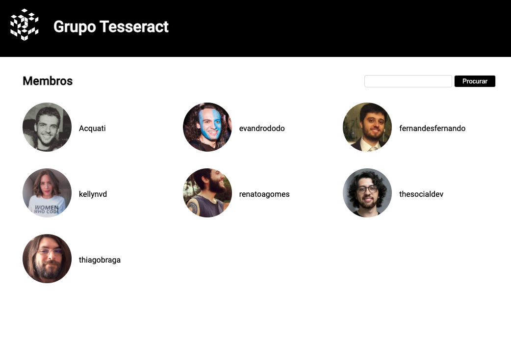

<h1 align="center">
<br>
  
<br>
<br>
Tesseract Challenge
</h1>

<p align="center">This is a challenge proposed by Tesseract.</p>

<p align="center">
  <a href="https://opensource.org/licenses/MIT">
    
  </a>
</p>

## Getting started

After pulling the code in the folder, you
should go to the folder using your terminal and do:

````
npm install
````

After downloading all the needed packages,
do:

````
nodemon src/server.js
````

This will initialize the server and you can go to http://localhost:3000/


## License

This project is licensed under the MIT License - see the [LICENSE](https://opensource.org/licenses/MIT) page for details.